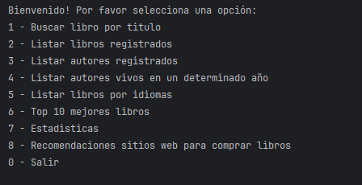
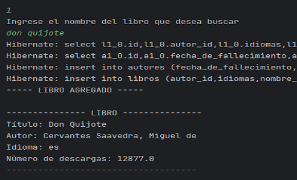
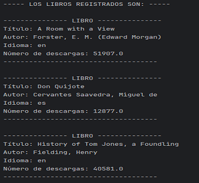

# Challenge literalura

Es una aplicación mediante la cual creamos un catálogo de libros, que ofrece una interacción textual (vía consola) con los usuarios,  donde pueden buscar y registrar libros en una base de datos y consultar información sobre los libros registrados e incluso otras consultas a través de la API Gutendex. Utilizamos Java, Spring y PostgreSQL, uso de Spring Data JPA para la persistencia de datos.

## Características principales
- Los usuarios pueden buscar libros por título.
- Listado de todos los libros registrados.
- Visualización de autores y listado de autores vivos por año.
- Búsqueda de libros por idioma.
- Generar estadisticas con base en las descargas
- Listar Top 10 libros Registrados
- Buscar Autor por nombre
- Visualización de autores y listado de autores fallecidos por año.
- Opción para salir de la aplicación.

### Tecnologías utilizadas
- Backend: Java y Spring (con énfasis en Spring Boot y Spring Data JPA).
- Base de datos: PostgreSQL para gestionar la información.
- API externa: Solo la funcionalidad de búsqueda inicial consulta datos de una API externa; las demás operaciones trabajan directamente con la base de datos.

#### # Modo de interacción
LiterAlura es una aplicación que se ejecutará desde la consola, para gestionar y consultar un catálogo de autores y libros. La aplicación permite realizar búsquedas, generar una base de datos con autores y libros, utilizando la API Gutendex.
cuenta con el un menu y diferentes funcionalidades que se detallan a continuación:
- Menú Principal
**************************************************
1 - Buscar Libro por Título
2 - Listar Libros Registrados
3 - Listar Autores Registrados
4 - Listar Autores vivos en un determinado año
5 - Listar Libros por Idioma
6 - Buscar Autor por nombre
7 - Listar Autores por rango de años de Nacimiento
8 - Top 10 libros más descargados
9 - Estadísticas
0 - Salir
##### Descripción

1 - Buscar Libro por Título

2 - Listar Libros Registrados

3 - Listar Autores Registrados

